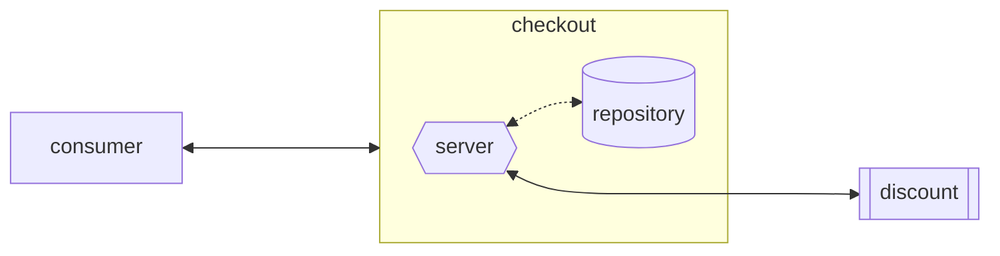
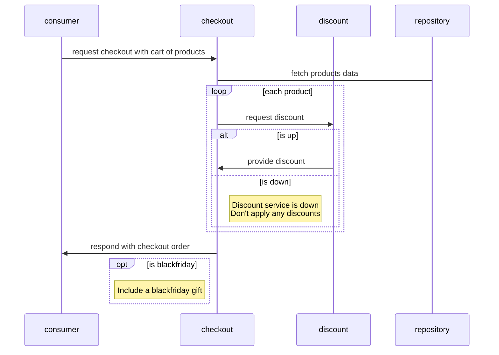

# Hash Test

Repository for Hash's Go Backend Developer technical test

More info on the technical test can be found here: https://github.com/hashlab/hiring/tree/master/challenges/pt-br/new-backend-challenge

## Overview

This project contains the `checkout` service responsible for creating a checkout order out of a cart of products. For this, we must consult the `discount` gRPC service, responsible for providing discount percentage for products.

## Architecture



A [Sequence Diagram](#sequence-diagram) is provided further below.

## Running 

There's multiple ways of running the project:
- Building from source with `go build` and running the output binary;
- Through `docker`;
- Through `docker` via `docker-compose`.
  
We'll focus on running the services through `docker-compose`.

**Make sure you have `docker` and `make` installed, and that the following ports are open: 8080, 50051!**

After cloning the project, on its root directory, run:
```
make run-services
```

This will build the project and run all necessary services (`checkout` and `discount`) on separate docker images.

Yup, that's it!

## API Documentation

API documentation (Swagger 2.0) can be found by going to [`localhost:8080/docs/index.html`](https://localhost:8080/docs/index.html).

Keep in kind that a Swagger page will only be provided if the service environment is set to either `DEVELOPMENT` or `STAGING` in the configuration file.

## Configuration

Our `checkout` service has a config file named [`config.yaml`](config.config/yaml), it's structured like so:
```yaml
service:
    port: :8080 # port for the service to bind to
    timeout: 10 # timeout for requests to service
    environment: "DEVELOPMENT" # environment the service will be running [enum:DEVELOPMENT, STAGING, PRODUCTION]
    core:
        black_friday_date: "08/08" # date for BlackFriday gifts [format:DD/MM]

discount:
    host: discount:50051 # address of the discount service
    timeout: 10 # timeout for discount's grpc connection

repository: # [optional]
    host: repository:5432 # address of a database [optional]

```

One last bit of configuration is the services `API_KEYS`, which can be set through env-vars, although a default is provided through [`docker-compose`](docker-compose.yml).

The project provides a base [`config.yaml`](config/config.yaml) that is enough to run both services via `docker-compose`.

If providing a custom config file, the path to it can be changed using the `CONFIG_FILE` env-var, if one's not found at the provided path the default [`config.yaml`](config/config.yaml) is used.

## Design Decisions

- Since specified in the challenge, no database is used for the service, although it offers a `Repository` interface for extendability. The default implementation uses Go's `//go:embed` directive to load data from the `products.json` file on init, this is why a repository host in the config file is optional for now;
- No cache was implemented between the services, but for Production it could be useful;
- A simple API Key implementation is in place, and as previously mentioned, keys can be customized through the `API_KEYS` env-var. In a production server we could use OAuth2 + JWT.

## Sequence Diagram

