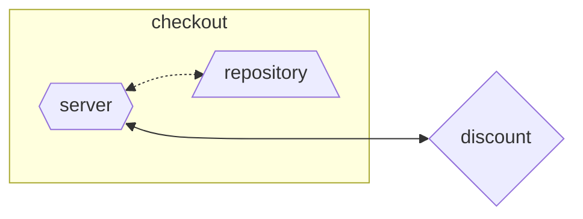

# Hash Test

Repository for Hash's Go Backend Developer technical test

More info on the technical test can be found here: https://github.com/hashlab/hiring/tree/master/challenges/pt-br/new-backend-challenge

# Overview

This project contains the `checkout` service responsible for creating a checkout order out of a cart of products. For this, we must consult the `discount` gRPC service, responsible for providing discount percentage for products.

## Architecture

## Sequence Diagram

